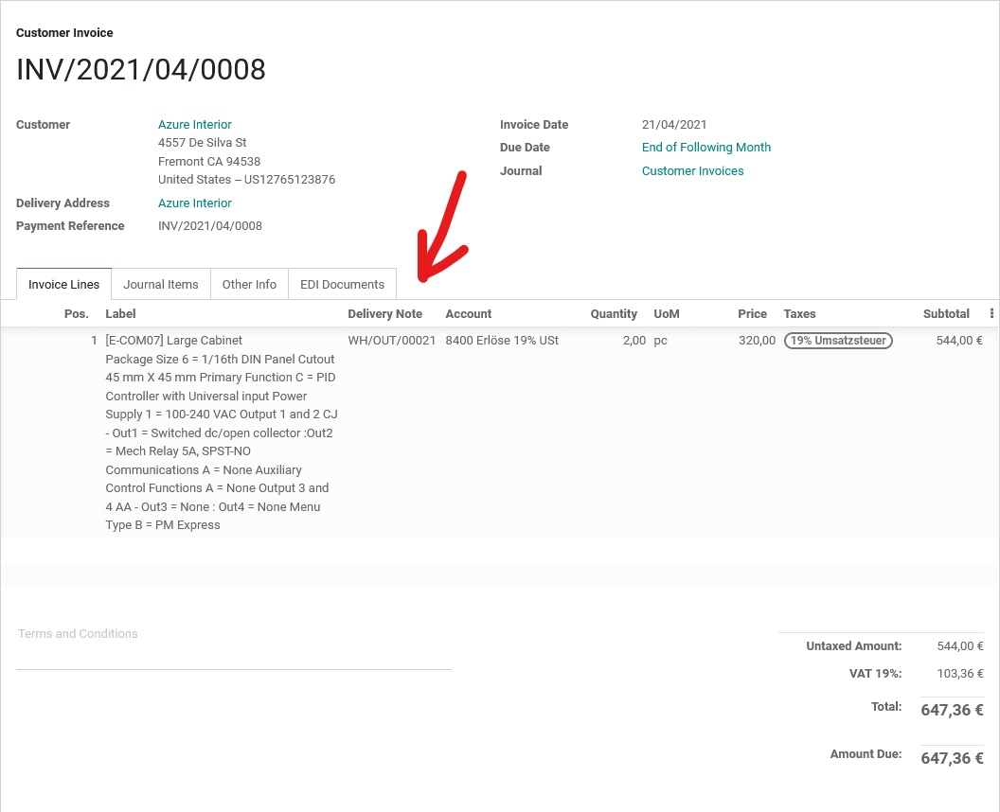

# About this module

It creates a relation between the invoice line and a delivery note. In accounting is important to know, which shipment/delivery is connected to the invoiced product, esspecially if you get a tax audit.

You can put this field onto your invoice easily just like the [mrx_pdf_report_mods](/mrx_pdf_report_mods/README.md) module does.
