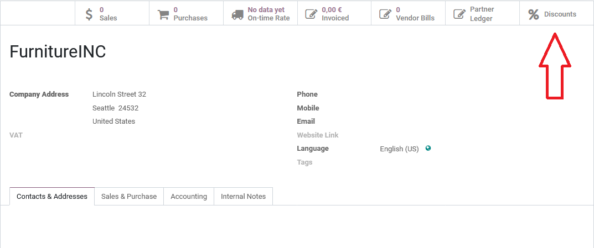
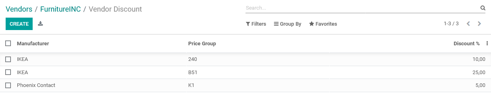
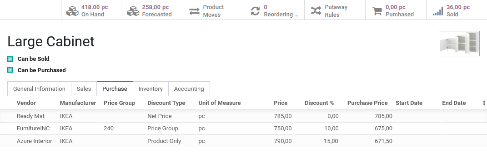

# About this module

This app provides possiblity to record information about vendor discount for a given product or product group. 
Given discounts are automaticaly filled on Purchase Orders if the selected vendor provide any discount for the given product.
Discount is propagated to the vendor bill as well.

Main features:

* Selectable Discount Type field (Netprice/Price Group/Product Only) to product supplier form.
* Purchase Price is a calculated field like Listprice - Discount. It's only informal, does not change normal behavior of the Sales app.
* Add Pricing Unit, Packaging Unit and MOQ fields to the product template.
* Add Discount Type, Discount % and Purchase Price fields to product supplier form/tree views.
* Add Packaging Unit, Pricing Unit fields to product supplier form and tree view.
* Add Pricing Unit, Discount % fields to purchase order form view.
* Add Pricing Unit field to sale order form view.
* Add Discount % Smart button to Contact/Partner form. Here can be set discount for price groups given by the partner.

By clicking the Discount Smart Button above you can set discounts by manufacturer and price group for the given vendor.

There are 3 discount types, that can be set by purchase:
  - Net Price (Vendor does not provide information about list price(MSRP) or discount, therefore we have only the given net price)
  - Price Group (Discount will be set by the price group where this product belongs to)
  - Product Only (Lets say a product belongs to a specific price group, but we buy frequently a large amount of this product, therefore the vendor gives us a special discount for this product alone)

